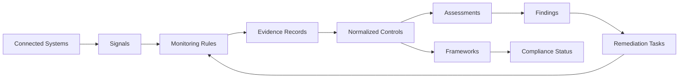
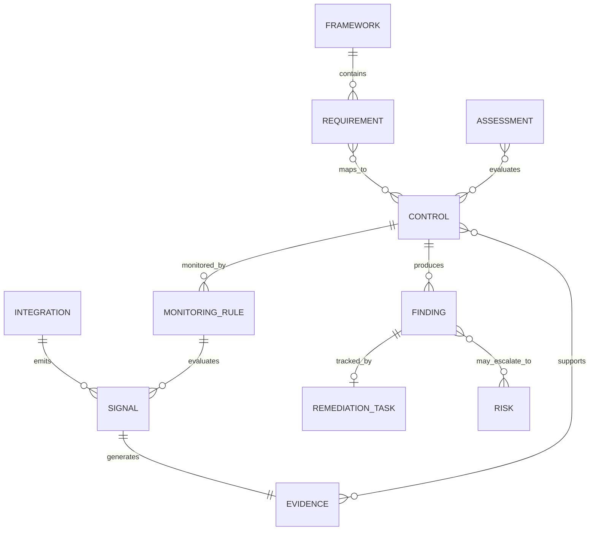

# RFC: ComplianceTech CCM React Prototype

## 1. Summary

Build a Vite + React + TypeScript prototype named ComplianceOps Cloud. The prototype will be a realistic B2B SaaS product shell for an enterprise ComplianceTech / GRC platform, with deeper implementation detail for Continuous Compliance Monitoring (CCM).

The app uses static mock data and light client-side state. It does not require authentication, backend services, real integrations, or persistence beyond optional local component state.

Primary product chain:

```text
Signal -> Evidence -> Control -> Assessment -> Framework -> Compliance Status
```

## 2. Goals

- Create a polished clickable demo that supports an interview case-study walkthrough.
- Show all major product modules in the left navigation.
- Implement a credible dashboard, framework posture view, control detail, assessment lifecycle, CCM deep dive, evidence inventory, findings, reports, integrations, risks, and vendors.
- Make CCM the highest-fidelity workflow.
- Use consistent mock data relationships across the app.
- Keep implementation simple enough to complete quickly while feeling enterprise-ready.

## 3. Non-Goals

- No real backend API.
- No real authentication.
- No real third-party integrations.
- No production-grade role-based access control.
- No external framework import.
- No full questionnaire builder.
- No real audit package generation.

## 4. Recommended Stack

- Vite
- React
- TypeScript
- React Router
- CSS modules, plain CSS, or Tailwind depending on project preference
- Optional charting library if already available; otherwise simple CSS-based charts are acceptable
- Optional icon library such as lucide-react

If dependencies are not already installed, keep the app lean and avoid adding heavy visualization libraries unless needed.

## 5. Application Shell

### Layout

Use a persistent shell with:

- Left sidebar navigation
- Top header with tenant name, search, environment badge, and user avatar placeholder
- Main content region
- Optional right-side detail drawer for evidence, findings, or controls

### Navigation

Routes:

- `/dashboard`
- `/frameworks`
- `/frameworks/:frameworkId`
- `/controls`
- `/controls/:controlId`
- `/assessments`
- `/assessments/:assessmentId`
- `/monitoring`
- `/monitoring/rules/:ruleId`
- `/monitoring/signals/:signalId`
- `/evidence`
- `/evidence/:evidenceId`
- `/findings`
- `/findings/:findingId`
- `/risks`
- `/vendors`
- `/reports`
- `/reports/:reportId`
- `/integrations`
- `/admin/scopes`

Default route should redirect to `/dashboard`.

### Visual Style

Use a quiet, enterprise SaaS style:

- Dense but readable dashboard
- Clear status badges
- Compact tables
- Tabs for detail pages
- Filter bars
- Breadcrumbs on detail pages
- Consistent severity and status colors
- No marketing-style landing page

## 6. Mock Data Model

Create TypeScript types in a shared mock data module. The exact file can be `src/data/mockData.ts` or equivalent.

### Core Types

```ts
type Status = 'passing' | 'failing' | 'needs_review' | 'not_monitored';
type Severity = 'critical' | 'high' | 'medium' | 'low';
type FindingStatus = 'open' | 'in_progress' | 'ready_for_review' | 'closed' | 'accepted_risk';
type EvidenceFreshness = 'current' | 'stale' | 'expired';
type IntegrationStatus = 'connected' | 'degraded' | 'disconnected';

interface User {
  id: string;
  name: string;
  role: string;
  team: string;
}

interface Scope {
  id: string;
  name: string;
  type: 'business_unit' | 'application' | 'infrastructure' | 'process' | 'vendor';
  ownerId: string;
}

interface Framework {
  id: string;
  name: string;
  version: string;
  postureScore: number;
  mappedControlIds: string[];
  domains: FrameworkDomain[];
}

interface FrameworkDomain {
  id: string;
  name: string;
  requirementIds: string[];
}

interface Requirement {
  id: string;
  frameworkId: string;
  citation: string;
  title: string;
  mappedControlIds: string[];
}

interface Control {
  id: string;
  code: string;
  title: string;
  description: string;
  ownerId: string;
  scopeIds: string[];
  status: Status;
  frameworkRequirementIds: string[];
  monitoringRuleIds: string[];
  evidenceIds: string[];
  findingIds: string[];
}

interface Assessment {
  id: string;
  name: string;
  frameworkId: string;
  scopeIds: string[];
  ownerId: string;
  status: 'draft' | 'in_progress' | 'in_review' | 'signed_off';
  dueDate: string;
  progressPercent: number;
  controlIds: string[];
  findingIds: string[];
}

interface QuestionnaireResponse {
  id: string;
  assessmentId: string;
  question: string;
  answer: string;
  ownerId: string;
  status: 'not_started' | 'submitted' | 'reviewed';
}

interface Integration {
  id: string;
  name: string;
  provider: 'okta' | 'aws' | 'github' | 'jira' | 'hris';
  status: IntegrationStatus;
  lastSyncAt: string;
  controlsCovered: number;
  evidenceGenerated: number;
}

interface MonitoringRule {
  id: string;
  name: string;
  description: string;
  integrationId: string;
  controlId: string;
  frequency: 'hourly' | 'daily' | 'weekly';
  status: Status;
  lastRunAt: string;
  lastResultSummary: string;
}

interface Signal {
  id: string;
  integrationId: string;
  ruleId: string;
  receivedAt: string;
  type: string;
  result: 'pass' | 'fail';
  summary: string;
  evidenceId: string;
}

interface Evidence {
  id: string;
  title: string;
  source: 'manual_upload' | 'okta' | 'aws' | 'github' | 'jira' | 'hris';
  collectionMethod: 'manual' | 'automated';
  collectedAt: string;
  freshness: EvidenceFreshness;
  reviewerStatus: 'needs_review' | 'approved' | 'rejected';
  signalId?: string;
  controlIds: string[];
  frameworkIds: string[];
  assessmentIds: string[];
}

interface Finding {
  id: string;
  title: string;
  severity: Severity;
  status: FindingStatus;
  source: 'automated_monitoring' | 'assessment_review' | 'manual';
  ownerId: string;
  dueDate: string;
  controlId: string;
  evidenceId?: string;
  assessmentId?: string;
  remediationTaskId?: string;
}

interface RemediationTask {
  id: string;
  title: string;
  system: 'jira' | 'manual';
  externalKey?: string;
  ownerId: string;
  status: 'todo' | 'in_progress' | 'ready_for_review' | 'done';
  dueDate: string;
}

interface Risk {
  id: string;
  title: string;
  ownerId: string;
  inherentScore: number;
  residualScore: number;
  treatment: 'mitigate' | 'accept' | 'transfer' | 'avoid';
  linkedFindingIds: string[];
  linkedControlIds: string[];
}

interface Vendor {
  id: string;
  name: string;
  criticality: 'critical' | 'high' | 'medium' | 'low';
  assessmentStatus: 'not_started' | 'in_progress' | 'review' | 'approved';
  ownerId: string;
  nextReviewDate: string;
}

interface Report {
  id: string;
  name: string;
  type: 'executive' | 'framework' | 'assessment' | 'evidence_package' | 'findings';
  frameworkId?: string;
  assessmentId?: string;
  generatedAt: string;
  summary: string;
}
```

## 7. Required Seed Data

### Tenant

Name: Acme Financial Services

### Users

- Maya Patel, Compliance Manager
- Ethan Brooks, IT Operations Owner
- Sofia Romero, Security Engineering Lead
- Liam Nguyen, Internal Auditor
- Ava Martin, Vendor Risk Manager

### Scopes

- Corporate IT
- Payments Platform
- Customer Data Warehouse
- Vendor Operations

### Frameworks

- SOC 2 Type II
- ISO 27001:2022
- NIST CSF 2.0

### Controls

- `AC-01`: Multi-factor authentication enforced for all workforce users
- `AC-02`: Quarterly privileged access review
- `CC-01`: Cloud storage encryption enabled
- `HR-01`: Background checks completed before start date
- `IR-01`: Incident response plan reviewed annually
- `VM-01`: Critical vulnerabilities remediated within SLA
- `SDLC-01`: Pull requests require review before merge

### Key Failed Scenario

Seed a failed MFA scenario:

- Integration: Okta
- Rule: `MFA_ENFORCED_WORKFORCE`
- Signal: Okta MFA policy evaluation failed
- Evidence: Okta MFA enforcement snapshot
- Control: `AC-01`
- Finding: 3 workforce users missing enforced MFA
- Remediation task: Jira `SEC-1842`
- Assessment impact: SOC 2 Readiness Q2
- Framework impact: SOC 2 and ISO 27001 posture decrease

## 8. Page Requirements

### Dashboard Page

Show:

- Overall compliance score
- Framework posture cards
- Monitored controls summary
- Findings by severity
- Evidence freshness
- Assessment timeline
- CTA into failing automated controls

Interactions:

- Click SOC 2 card to open `/frameworks/soc-2`.
- Click failing controls to open `/monitoring`.

### Framework Detail Page

Show:

- Framework summary
- Posture score
- Domains
- Requirements
- Mapped controls
- Failed controls
- Evidence coverage
- Related assessment

Interactions:

- Click `AC-01` to open `/controls/ac-01`.

### Control Detail Page

Show:

- Control metadata
- Owner and scope
- Status
- Framework mappings
- Monitoring rules
- Evidence records
- Findings
- Assessment impact
- Activity timeline

Interactions:

- Open latest evidence.
- Open related monitoring rule.
- Open related finding.

### Continuous Monitoring Page

Show:

- Integration health strip
- Rule status summary
- Failing checks table
- Recent signal stream
- Evidence generated today
- Control impact panel

Interactions:

- Filter by status, integration, framework, or control owner.
- Open `MFA_ENFORCED_WORKFORCE`.

### Monitoring Rule Detail Page

Show:

- Rule name and description
- Integration source
- Frequency
- Last run
- Last result
- Linked control
- Linked frameworks
- Latest signals
- Generated evidence

Interactions:

- Open failed signal.
- Open linked control or evidence.

### Signal Detail Page

Show:

- Source integration
- Received timestamp
- Result
- Summary
- Affected entities
- Linked rule
- Generated evidence

Interactions:

- Open generated evidence.

### Evidence Detail Page

Show:

- Evidence metadata
- Source and collection method
- Freshness
- Reviewer status
- Linked signal
- Linked controls
- Linked frameworks
- Linked assessment
- Evidence preview

Interactions:

- Open finding if one exists.
- Create finding if one does not exist.

### Findings Page And Detail

Show:

- Findings table
- Severity
- Status
- Owner
- Due date
- Source
- Linked control

Detail page:

- Finding summary
- Remediation task
- Linked evidence and control
- Activity timeline
- Reviewer notes

Interactions:

- Assign owner.
- Move to In Progress.
- Mark Ready for Review.
- Run simulated recheck.
- Close finding after successful recheck.

### Assessment Detail Page

Show:

- Assessment name, owner, due date, status
- Scope
- Framework
- Questionnaire progress
- Control evaluation progress
- Evidence completeness
- Findings blocking sign-off
- Review and sign-off timeline

### Reports Page

Show:

- Report cards
- Executive posture report
- SOC 2 readiness report
- Evidence package
- Findings summary

Report detail:

- Generated from metadata
- Framework posture
- Control status by domain
- Evidence readiness
- Open and closed findings

### Integrations Page

Show:

- Integration cards for Okta, AWS, GitHub, Jira, and HRIS
- Status
- Last sync
- Controls covered
- Evidence generated
- Recent sync issues

### Risks And Vendors Pages

Show credible shell views:

- Risks table with scores, treatment, owner, and linked findings
- Vendors table with criticality, assessment status, owner, and next review date

These pages demonstrate extensibility and do not need deep interactions for the first prototype.

## 9. Client-Side State

Implement state only where it improves the walkthrough:

- Finding status transitions
- Remediation task status transitions
- Simulated recheck result
- Control status update from failing to passing
- Dashboard posture update after remediation

Recommended behavior:

1. Initial state has `AC-01` failing and SOC 2 at 88 percent.
2. User opens finding `find-mfa-001`.
3. User marks remediation ready for review.
4. User runs simulated recheck.
5. Recheck passes.
6. `AC-01` becomes passing.
7. Finding becomes closed.
8. SOC 2 posture increases to 92 percent.

This can be implemented with React state in a top-level provider. Persistence is optional.

## 10. Component Inventory

Recommended shared components:

- `AppShell`
- `SidebarNav`
- `TopBar`
- `MetricCard`
- `FrameworkPostureCard`
- `StatusBadge`
- `SeverityBadge`
- `FilterBar`
- `DataTable`
- `Timeline`
- `RelationshipPanel`
- `EvidencePreview`
- `IntegrationHealthCard`
- `FindingWorkflowPanel`
- `PageHeader`
- `Breadcrumbs`

Keep components simple. Avoid building a design system beyond what the prototype needs.

## 11. Data Flow

The app should use static arrays and relationship IDs.

Example flow:

1. `Signal` references `MonitoringRule`.
2. `MonitoringRule` references `Control`.
3. `Signal` references generated `Evidence`.
4. `Evidence` references `Control`, `Framework`, and `Assessment`.
5. `Control` references `Finding`.
6. `Finding` references `RemediationTask`.
7. Framework and dashboard scores derive from control statuses or use seeded values updated by the demo state.

Derived values can be simple helper functions. Do not overbuild scoring logic.

## 12. Architecture Diagram



## 13. Object Relationship Diagram



## 14. Acceptance Criteria

The prototype implementation is complete when:

- All primary routes render without errors.
- Left navigation covers all major modules.
- Dashboard links into SOC 2 posture and CCM.
- The failed MFA scenario is traceable from dashboard to report.
- CCM pages include monitoring rules, signals, evidence, integrations, findings, and posture impact.
- The assessment lifecycle is visible and connected to controls and findings.
- At least one simulated remediation flow changes visible status.
- Reports show that they are generated from evidence, controls, assessment, and framework data.
- Risks and vendors exist as extensibility modules.
- The demo can be walked through in 8 to 12 minutes.

## 15. Implementation Order

1. Initialize Vite + React + TypeScript app.
2. Add static mock data and shared types.
3. Build application shell and routing.
4. Build dashboard and framework detail.
5. Build control detail and relationship panels.
6. Build CCM overview, rule detail, signal detail, and evidence detail.
7. Build findings and remediation state transitions.
8. Build assessment detail and reports.
9. Add integrations, risks, vendors, and admin scopes shell pages.
10. Polish visual hierarchy, copy, empty states, and demo flow.
11. Run local build and browser verification.

## 16. Testing Plan

### Functional Checks

- Dashboard renders seeded metrics.
- Sidebar navigation works for every module.
- SOC 2 framework page links to `AC-01`.
- `AC-01` links to rule, evidence, and finding.
- Monitoring rule links to failed signal.
- Failed signal links to generated evidence.
- Evidence links to finding.
- Finding remediation flow updates status.
- Recheck changes control and framework posture.

### UX Checks

- Text fits on desktop and mobile widths.
- Tables remain readable.
- Status and severity colors are consistent.
- Breadcrumbs and relationship panels make cross-module navigation obvious.
- The product does not feel like a marketing landing page.

### Build Checks

- TypeScript compiles.
- Production build succeeds.
- No console errors during golden path walkthrough.

## 17. Assumptions

- The prototype is for a product case-study presentation, not production deployment.
- Static mock data is acceptable.
- React is the target implementation.
- The strongest product investment should be CCM.
- Enterprise polish matters more than broad feature depth.
- The implementation should optimize for a compelling walkthrough rather than exhaustive configuration.
