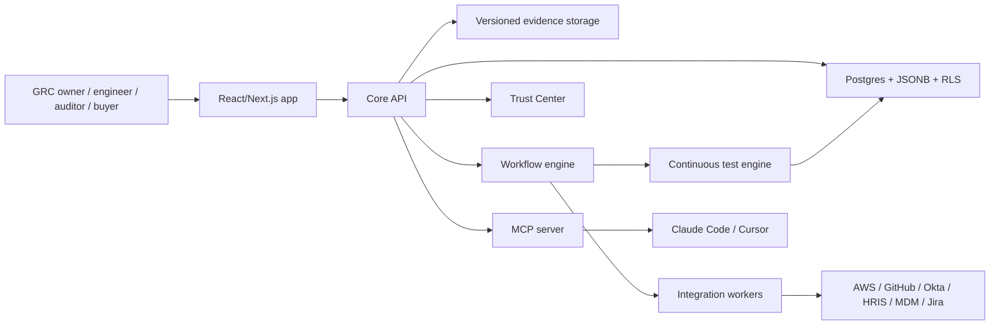
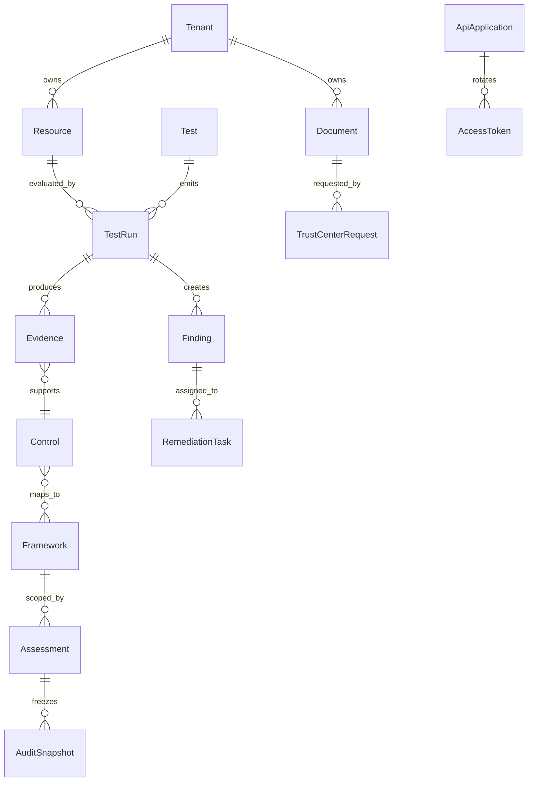
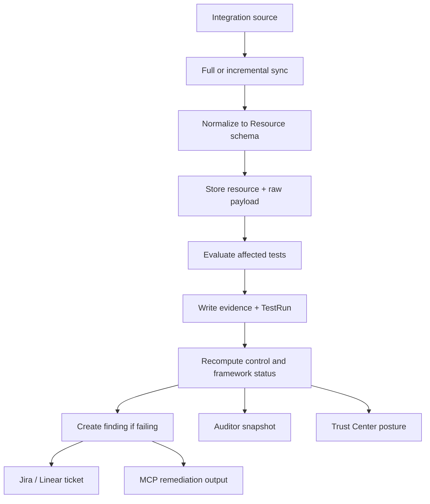

# Aegis Case Study Supporting Document

Owner: Rushil Kaul
Status: Submission-ready
Prototype repository: https://github.com/TheRuKa7/prototype_fastcurve

## Executive Summary

Aegis is a Continuous Trust Management platform for mid-market B2B SaaS companies pursuing their first SOC 2 Type II. It continuously ingests live signals from cloud, identity, code, HR, MDM, and ticketing tools; converts those signals into mapped evidence; rolls evidence into controls, assessments, frameworks, and compliance status; and uses the resulting trust posture to accelerate security reviews through a buyer-facing Trust Center.

The product experience intentionally focuses on one strong wedge: SOC 2 readiness plus Trust Center revenue impact plus developer-native remediation. It avoids becoming a sprawling GRC suite.

Core traceability chain:

```text
Signal -> Evidence -> Control -> Assessment -> Framework -> Compliance Status
```

## Submission Package

| Expected item | Submission artifact |
|---|---|
| Prototype link | Netlify-ready repo at `TheRuKa7/prototype_fastcurve`; local verified route is `http://localhost:5173`. |
| Supporting document | This document, plus PRD, user flow, RFC, completeness matrix, and product demo guide in `/docs`. |
| Optional architecture diagrams | Included below: services, data model, and integration layer. |

## Supporting Artifacts

- Product demo guide: `docs/product-demo-user-guide.md`
- Completeness matrix: `docs/completeness-matrix.md`
- Product requirements: `docs/prd-compliancetech-ccm.md`
- User flow: `docs/user-flow-compliancetech-ccm.md`
- Prototype RFC: `docs/rfc-compliancetech-ccm-prototype.md`

## PM Narrative

The product should be introduced as a wedge, not a platform sprawl. Aegis starts with a focused SOC 2 Type II workflow for a mid-market SaaS company because that is where compliance pain, sales urgency, and implementation tractability meet. Once the trust graph exists, the same evidence can support additional frameworks, buyer-facing Trust Center proof, and developer remediation workflows.

The key differentiation is that Aegis does not treat remediation as a compliance-admin task. The engineer sees the finding in normal work surfaces and can use MCP tools to ask what failed, which resources are affected, and how to fix the issue with Terraform or CLI output.

## MVP Boundary

P0 includes SOC 2 monitoring, evidence automation, remediation, My Work, auditor snapshot, Trust Center access workflows, Custom Resources API, and safe public API token rotation.

P1 includes a fuller MCP server, Trust Center AI, ISO 27001 and HIPAA expansion, multi-step approvals, and SIEM streaming.

P2 includes agentic TPRM, privacy workflows, enterprise business-unit scoping UI, and an integration marketplace.

## Service Architecture



## Data Model



## Integration Layer



## Known Prototype Limits

- The app is a static React SPA with mock data.
- Integrations, tickets, AI, MCP, and auth are represented as product surfaces, not live services.
- Netlify deployment uses the Git-connected repository, build command `npm run build`, and publish directory `dist`.
